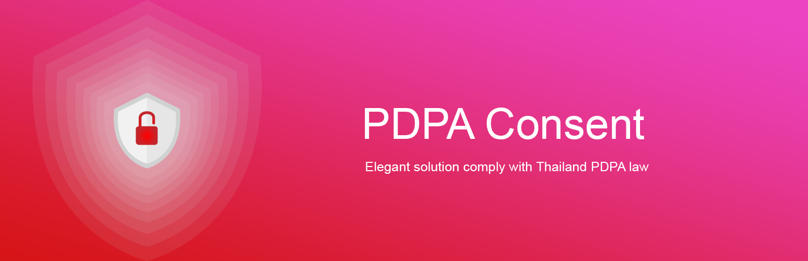

  

This WordPress plugin help you to generate Thailand PDPA consent terms page and consent notification popup. 
You can edit the term page and publish on your website with elegant and powerful solution. !!! No jquery need at all.

### Code of conduct

- ปลั๊กอิน PDPA Consent นี้จัดทำขึ้นเพื่อตอบสนองต่อการปฏิบัติตาม พ.ร.บ.คุ้มครองข้อมูลส่วนบุคคล 2562 (PDPA) ของประเทศไทย
- ปลั๊กอิน PDPA Consent นี้จัดทำขึ้นเพื่อแจกฟรี
- ปลั๊กอิน PDPA Consent ไม่มีความประสงค์ที่จะจัดเก็บค่าใช้งานแต่อย่างใด
- ไม่ได้รับประกันในด้านความปลอดภัย
- ปลั๊กอิน  PDPA Consent ไม่ได้ป้องกันการฟ้องร้องที่อาจเกิดขึ้นโดยคู่กรณีได้  
- ผู้ใช้งานปลั๊กอิน PDPA Consent เป็นผู้รับผิดชอบและตัดสินใจต่อการใช้และรักษาความปลอดภัยของข้อมูล
- ปลั๊กอิน PDPA Consent ไม่ได้เป็นผู้ประมวลผลข้อมูลหรือใช้ข้อมูลส่วนบุคคล
- ปลั๊กอิน PDPA Consent ไม่ได้เป็นผู้บล็อคการทำงานส่วนใดของเว็บไซต์ 
- ปลั๊กอิน PDPA Consent จะมีการปรับปรุงเงื่อนไข PDPA ให้รัดกุมมากขึ้นเสมอ
- การบริจาคมิใช่เพื่อเป็นสิ่งแลกเปลี่ยนในการใช้งานปลั๊กอิน PDPA Consent

### Download new release
-> [Release page is here.](https://github.com/iamapinan/PDPA-Consent/releases)

### To install. 
1. Install PDPA Consent via the WordPress.org plugin directory, or by uploading the files to your server
2. Activate the plugin through the 'Plugins' menu in WordPress
3. Go to the PDPA Consent settings and set your options.

### Features
* Customizable message
* Identity setup
* Popup placement
* Consent page generate
* CSS Class for developer
* Dark mode
* Button color config
* Support WP Super Cache (idea from Cookie Notice plugin)
* Save user action to database
* Display user PDPA Status on user list
* Responsive
* Multi language support (Thai, English) more translate is accept

### Roadmap

* หน้าจัดการข้อมูลของผู้ใช้
* ผู้ใช้สามารถขอถ่ายโอนข้อมูลได้
* ผู้ใช้สามารถลบหรือขอให้ลบข้อมูลได้ ขึ้นกับนโยบาย
* ผู้ใช้สามารถเลือกการยินยอมใหม่ได้
* ผู้ใช้สามารถแก้ไข/ขอให้แก้ไข ข้อมูลที่ยินยอมได้
* ผู้ใช้สามารถเลือกประเภทข้อมูลที่ยินยอมและไม่ยินยอมได้
* แบ่งประเภทข้อมูล พืื้นฐาน, ละเอียดอ่อน, ท้างอ้อม
* เพิ่มเรื่อง การจัดเก็บข้อมูลแต่ละประเภท
* เพิ่มเรื่อง การเผยแพร่ข้อมูลผ่าน API หรือไม่
* เพิ่มเรื่อง การส่งข้อมูลไปต่างประเทศ หรือไม่
* Wizard การตั้งค่า
* ให้ผู้ใช้ต้องติ๊กถูกก่อนคลิกยินยอม โดยค่าเริ่มต้นคือไม่ติ๊ก
* บันทึกประวัติการ ยินยอม/ไม่ยินยอม ย้อนหลัง

### Contributors.
- **Apinan Woratrakun** *as developer* <iamapinan@gmail.com>, <https://facebook.com/9apinan>, <https://ioblog.me>
- **Aeknarin Sirisub** *as technical privacy system desgin* <https://www.facebook.com/swodsman>

[GNU 3.0 License](https://opensource.org/licenses/lgpl-3.0.html0)

### Special Thank
* Thai Programmer Association
* WordPress Bangkok friends

### Changelogs

#### 1.0.2
* Add dark mode
* Button color
* Use page id as privacy page url link
* List of css class for developer
* Remove custom css for security reason
* Fix security and code style