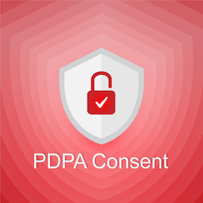

# PDPA Consent

This WordPress plugin help you to generate Thailand PDPA consent terms page and consent notification popup. 
You can edit the term page and publish on your website with elegant and powerful solution.

### To install. 
1. Install PDPA Consent via the WordPress.org plugin directory, or by uploading the files to your server
2. Activate the plugin through the 'Plugins' menu in WordPress
3. Go to the PDPA Consent settings and set your options.

### Contributors.
- **Apinan Woratrakun** *as developer* <iamapinan@gmail.com>, <https://facebook.com/9apinan>, <https://ioblog.me>
- **Aeknarin Sirisub** *as technical privacy system desgin* <https://www.facebook.com/swodsman>

